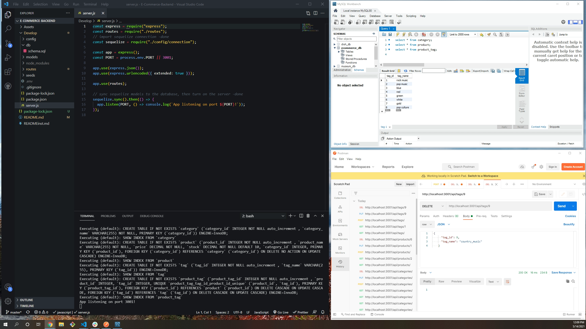

  # 

  # E-Commerce Backend

  ## Contents:
  #### [Description](#description:)
  #### [Installation](#installation:)
  #### [Usage](#usage;)
  #### [Questions](#questions:)
  #### [License](#license:)
  &nbsp;
  
  ## Description: 

  #### E-Commerce Backend is an application that manages a database for an e-commerce site.  It allows the user to create, read, update and delete data from the application's database.
  &nbsp; 
  
  [See E-Commerce Backend on GitHub](https://github.com/Xr7TSi/E-Commerce-Backend)    

  

  ## Installation: 

  #### From the command line, run npm i.  Launch MYSQL from the command line and create the database as defined in schemas.sql.  From the command line, run npm run seed to seed the database. Invoke the application with the command "node index.js."
  &nbsp;

  ## Usage: 

  #### See the links for a demo:  
  #### https://drive.google.com/file/d/1HpGLleqq0e4cOfkWLdCF3iqyO7RI6oG1/view?usp=sharing
  #### https://drive.google.com/file/d/1WZy_wYWBugRl0l6y_7bWZu8AMb5a7eyc/view?usp=sharing
  #### https://drive.google.com/file/d/1-DQJz04ZTlx-tQxVLHooSFWRycQOo-MV/view?usp=sharing
  &nbsp;

  
  ## Questions?

  #### Github: https://github.com/Xr7TSi
  #### Email me at jrein1296@gmail.com for any additional questions.
  &nbsp;

  License:
  #### Mozilla
  #### https://opensource.org/licenses/MPL-2.0
